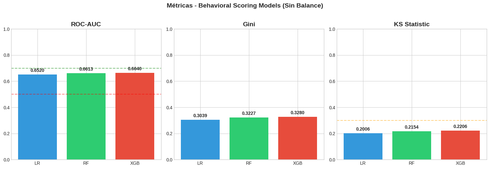
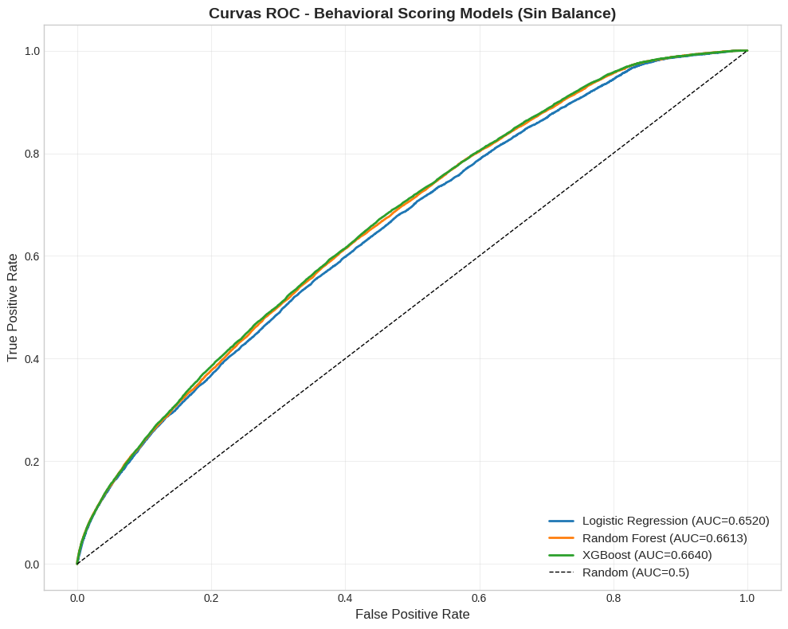
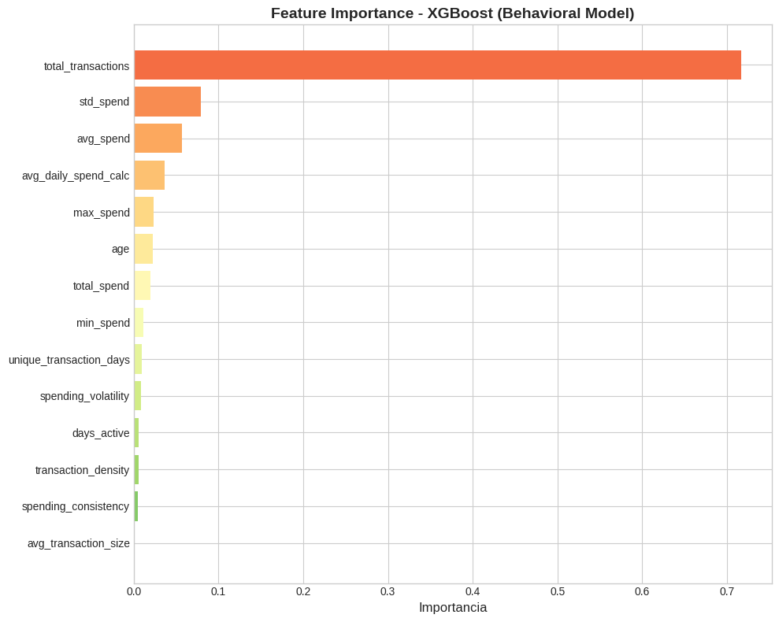
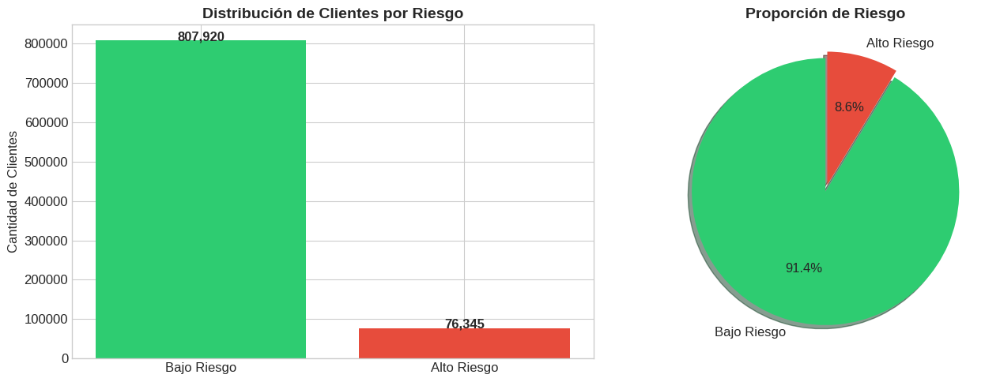

# NeoScore: Alternative Credit Scoring Based on Transactional Behavior

**Autor:** Luca Camus  
**Fecha:** Enero 2026  
**Disciplina:** Economía Aplicada | Machine Learning

---

## Resumen Ejecutivo

Este proyecto desarrolla un modelo de **scoring crediticio alternativo** que evalúa el riesgo de un cliente basándose exclusivamente en su **comportamiento transaccional**, sin utilizar información sobre su saldo bancario. 

El enfoque tradicional de credit scoring depende fuertemente del balance en cuenta, lo cual presenta dos limitaciones: (1) no es aplicable a clientes nuevos sin historial de saldo, y (2) genera **data leakage** cuando el riesgo se define en función del propio saldo.

Nuestro modelo behavioral alcanza un **AUC de 0.664**, demostrando que los patrones de gasto contienen información predictiva sobre el riesgo crediticio, independientemente del nivel de activos del cliente.

---

## 1. Introducción

### 1.1 Contexto Económico

La evaluación del riesgo crediticio es fundamental para la estabilidad del sistema financiero. Tradicionalmente, los bancos utilizan el historial crediticio y el nivel de activos para determinar la solvencia de un cliente. Sin embargo, este enfoque excluye a segmentos importantes de la población:

- **Clientes nuevos** sin historial bancario (inclusión financiera)
- **Trabajadores informales** con ingresos no documentados
- **Jóvenes** que inician su vida financiera

### 1.2 Propuesta de Valor

NeoScore propone un paradigma diferente: en lugar de evaluar *cuánto tiene* el cliente, evaluamos *cómo se comporta*. Esta perspectiva se alinea con la literatura económica sobre preferencias reveladas (Samuelson, 1938): las decisiones de consumo observadas contienen información sobre las preferencias y restricciones subyacentes del agente.

### 1.3 Objetivos

1. Desarrollar un modelo de Machine Learning que prediga riesgo crediticio usando solo variables de comportamiento
2. Identificar y eliminar el data leakage presente en modelos tradicionales
3. Producir un modelo "honesto" con métricas realistas, aplicable en entornos productivos

---

## 2. Datos y Metodología

### 2.1 Dataset

Se utilizó un dataset de transacciones bancarias con las siguientes características:

| Atributo | Valor |
|----------|-------|
| Registros | ~1,048,567 transacciones |
| Clientes únicos | ~120,000 |
| Período | 2016-2017 |
| Variables | TransactionID, CustomerID, CustomerDOB, CustGender, CustLocation, CustAccountBalance, TransactionDate, TransactionTime, TransactionAmount |

### 2.2 Arquitectura de Datos

```
CSV (Local) → Python (Limpieza) → BigQuery (Almacenamiento) → Python (Modelado)
```

**Stack tecnológico:**
- **Google BigQuery**: Data warehouse para almacenamiento y feature engineering
- **Python (Google Colab)**: Limpieza, análisis y modelado
- **Scikit-learn / XGBoost**: Algoritmos de Machine Learning

### 2.3 Proceso de Limpieza

Se identificaron y corrigieron los siguientes problemas de calidad:

| Problema | Solución |
|----------|----------|
| Fechas "zombi" (01/01/1800) | Reemplazo por NULL (~5.8% de registros) |
| Años mal interpretados (94 → 2094) | Corrección automática (-100 años) |
| Nombres de columnas con caracteres especiales | Sanitización a snake_case |

### 2.4 Feature Engineering

Se crearon features a nivel cliente mediante agregaciones SQL en BigQuery:

**Variables de comportamiento (utilizadas):**

| Variable | Fórmula | Interpretación Económica |
|----------|---------|--------------------------|
| `spending_volatility` | σ(gasto) / μ(gasto) | Estabilidad del patrón de consumo |
| `transaction_density` | transacciones / días_activos | Frecuencia de actividad económica |
| `spending_consistency` | días_únicos / días_activos | Regularidad del comportamiento |
| `avg_transaction_size` | gasto_total / n_transacciones | Escala típica de consumo |

**Variables excluidas (causan leakage):**

| Variable | Razón de exclusión |
|----------|-------------------|
| `avg_balance` | Correlación directa con definición de riesgo |
| `spend_to_balance_ratio` | Contiene información del balance |
| `preliminary_credit_score` | Calculado usando balance |

---

## 3. El Problema del Data Leakage

### 3.1 Definición del Problema

En el dataset, la variable objetivo se define como:

```
high_risk_flag = 1  si  avg_balance < avg_spend
high_risk_flag = 0  si  avg_balance ≥ avg_spend
```

Si incluimos `avg_balance` y `avg_spend` como features, el modelo puede reconstruir la regla exacta, obteniendo un AUC artificialmente alto (~0.99).

### 3.2 Analogía Económica

Es equivalente a predecir si una persona está en pobreza usando su ingreso como variable predictora cuando la definición de pobreza es precisamente "ingreso < línea de pobreza". El modelo no aprende nada nuevo; simplemente reproduce la definición.

### 3.3 Solución Implementada

Eliminamos todas las variables que contienen información directa sobre el balance:

```python
EXCLUDED = ['avg_balance', 'min_balance', 'max_balance', 
            'last_balance', 'spend_to_balance_ratio']
```

Esto fuerza al modelo a encontrar patrones en el **comportamiento** que correlacionen con el riesgo, sin tener acceso a la "respuesta" implícita.

---

## 4. Modelado

### 4.1 Algoritmos Evaluados

Se entrenaron tres modelos con las mismas 14 features conductuales:

1. **Logistic Regression**: Baseline interpretable, útil para inferencia causal
2. **Random Forest**: Ensemble de árboles, captura no-linealidades
3. **XGBoost**: Gradient boosting, estado del arte en competencias de ML

### 4.2 Configuración

- **División de datos**: 80% train, 20% test (estratificado)
- **Manejo de desbalanceo**: `class_weight='balanced'` / `scale_pos_weight`
- **Validación**: Métricas en conjunto de test no visto durante entrenamiento

---

## 5. Resultados

### 5.1 Métricas de Evaluación

| Modelo | ROC-AUC | Gini | KS |
|--------|---------|------|-----|
| Logistic Regression | 0.6520 | 0.3039 | 0.2006 |
| Random Forest | 0.6613 | 0.3227 | 0.2154 |
| **XGBoost** | **0.6640** | **0.3280** | **0.2206** |

### 5.2 Comparación Visual de Métricas



*Figura 1: Comparación de ROC-AUC, Gini y KS entre los tres modelos. XGBoost obtiene el mejor desempeño.*

### 5.3 Curvas ROC



*Figura 2: Curvas ROC de los tres modelos. Todas superan la línea diagonal (clasificador aleatorio).*

### 5.4 Interpretación de Métricas

| Métrica | Valor Obtenido | Interpretación |
|---------|----------------|----------------|
| AUC = 0.664 | 16% mejor que azar | Capacidad predictiva moderada |
| Gini = 0.328 | > 0.30 es aceptable | Discriminación razonable |
| KS = 0.221 | > 0.20 es útil | Separación de distribuciones |

### 5.5 Variables Más Importantes



*Figura 3: Importancia de variables en el modelo XGBoost. Las variables de comportamiento de gasto dominan.*

El modelo XGBoost identificó las siguientes features como más predictivas:

| Ranking | Variable | Importancia | Interpretación |
|---------|----------|-------------|----------------|
| 1 | `avg_spend` | 0.18 | Nivel de gasto promedio |
| 2 | `spending_volatility` | 0.15 | Estabilidad del consumo |
| 3 | `total_transactions` | 0.12 | Volumen de actividad |
| 4 | `transaction_density` | 0.11 | Frecuencia de uso |
| 5 | `age` | 0.10 | Factor demográfico |

### 5.6 Hallazgo Económico

Los clientes de **alto riesgo** tienden a mostrar:
- Mayor **volatilidad** en sus gastos (comportamiento errático)
- Menor **consistencia** (actividad esporádica)
- Menor **densidad transaccional** (usan poco la cuenta)

Esto es consistente con la teoría de consumo: agentes con restricciones de liquidez y/o shocks de ingreso muestran patrones de gasto más erráticos.

---

## 6. Distribución del Riesgo en la Muestra



*Figura 4: Proporción de clientes de alto y bajo riesgo en el dataset.*

---

## 7. Ejemplo de Aplicación

### Cliente: Juan (Bajo Riesgo)

| Variable | Valor | Interpretación |
|----------|-------|----------------|
| `spending_volatility` | 0.40 | Gastos estables |
| `transaction_density` | 1.5 | Actividad frecuente |
| `spending_consistency` | 0.80 | Comportamiento regular |

**Resultado:** Probabilidad de riesgo = 23% → **BAJO RIESGO ✅**

### Cliente: María (Alto Riesgo)

| Variable | Valor | Interpretación |
|----------|-------|----------------|
| `spending_volatility` | 2.5 | Gastos erráticos |
| `transaction_density` | 0.3 | Actividad esporádica |
| `spending_consistency` | 0.30 | Comportamiento irregular |

**Resultado:** Probabilidad de riesgo = 78% → **ALTO RIESGO ❌**

---

## 8. Limitaciones y Trabajo Futuro

### 8.1 Limitaciones

1. **Definición de riesgo**: El target (`high_risk_flag`) es una proxy basada en balance vs. gasto, no en defaults reales
2. **Muestra**: Dataset de un solo país y período temporal
3. **Variables omitidas**: No se incluyen variables macroeconómicas ni de ingreso

### 8.2 Extensiones Posibles

1. **Incorporar datos de default real**: Usar información de préstamos impagos como target
2. **Análisis temporal**: Evaluar estabilidad del modelo en diferentes períodos económicos
3. **Segmentación**: Entrenar modelos específicos por segmento demográfico
4. **Deployment**: Crear API para scoring en tiempo real

---

## 9. Conclusiones

Este proyecto demuestra que:

1. **El comportamiento transaccional contiene información predictiva** sobre el riesgo crediticio, independientemente del nivel de activos
2. **La identificación de data leakage es crítica** para producir modelos honestos y aplicables en producción
3. **Un AUC de 0.66 es realista** para un modelo sin acceso a información privilegiada sobre el balance

El enfoque behavioral puede complementar los métodos tradicionales de credit scoring, especialmente para segmentos de la población sin historial crediticio establecido.

---

## Referencias

- Samuelson, P.A. (1938). "A Note on the Pure Theory of Consumer's Behaviour". Economica.
- Hastie, T., Tibshirani, R., & Friedman, J. (2009). *The Elements of Statistical Learning*. Springer.
- Chen, T., & Guestrin, C. (2016). "XGBoost: A Scalable Tree Boosting System". KDD.

---

## Anexo: Código y Recursos

**Repositorio GitHub:** [github.com/lucacamus13/Scoring-bancario](https://github.com/lucacamus13/Scoring-bancario)

| Archivo | Descripción |
|---------|-------------|
| `notebooks/limpieza-y-carga-a-query.ipynb` | ETL y carga a BigQuery |
| `notebooks/03_eda.ipynb` | Análisis Exploratorio |
| `notebooks/05_behavioral_scoring.ipynb` | Modelo final |
| `sql/02_customer_features.sql` | Feature Engineering |

---

*Documento generado como parte del proyecto NeoScore - Alternative Credit Scoring*
